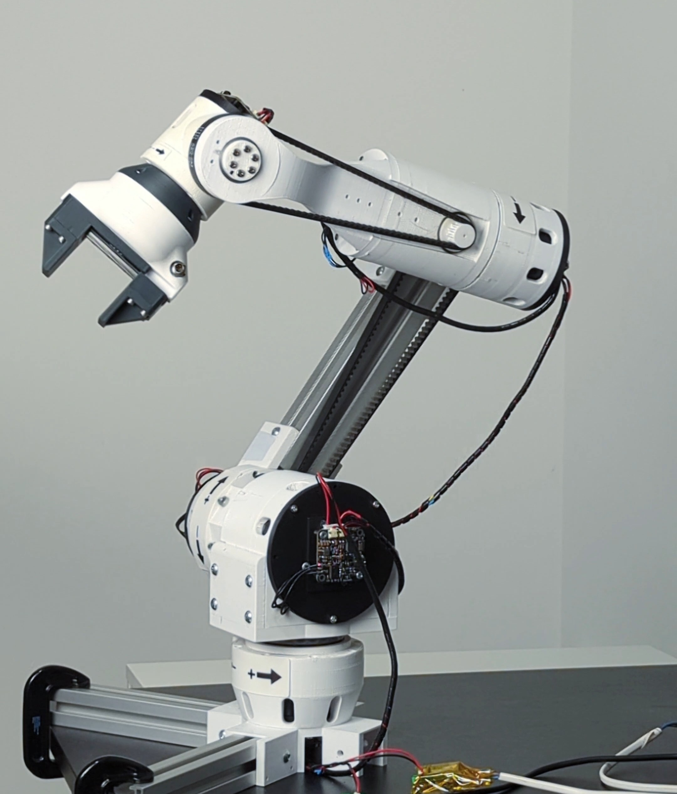

  
# CM6 V2 Robotic arm

Our official website: https://source-robotics.com/  
Join the discord community: https://discord.com/invite/prjUvjmGpZ

**If you want to build old version of CM6 check branch CM6_V1** 

**Main difference between V1 and V2 are in the drivers used. V1 used S-drive that was hard to source and had poor software support and were expensive while V2 uses [Spectral drives](https://github.com/PCrnjak/Spectral-Micro-BLDC-controller) that are much cheeper and have good software support and connectivity.**

CM6 uses 6 gimbal BLDC motors paired with small gear ratio gearboxes ( from 5:1 to 9:1), by doing that it is passively compliant and safe. Each Joint uses an [Spectral driver](https://github.com/PCrnjak/Spectral-Micro-BLDC-controller) that is mounted on modular actuator designs for specific gimbal motors. Design can be changed easily by using different-sized aluminum extrusions or changing the gear ratio of modular gearboxes. The robots main goal is to be research platform for developement of compliant and safe robotics. 

***Note* that this robot is not as refined as our other robots like PAROL6; some parts are hard to source and might be much more expensive. Building instructions are also not as good and you will need to tinker a lot!**

# Contents:

- [Robot arm build instructions](https://github.com/PCrnjak/CM6_COBOT_ROBOT/blob/main/assembly_instructions_v1.pdf)
- [Robot python software and GUI *Coming soon]()

# Where to see more CM6 robotic arm?
- [Youtube](https://www.youtube.com/channel/UCp3sDRwVkbm7b2M-2qwf5aQ)
- [Hackaday](https://hackaday.io/project/180588-cm6-compliant-3d-printed-robotic-arm)
- [Instagram](https://www.instagram.com/source_robotics/)

# Support the project

The majority of this project is open source and freely available to everyone. Your assistance, whether through donations or advice, is highly valued. Thank you!

# Project is under MIT Licence
